<div align="center">

# Calibre M-01 · Tourbillon Volant

**A mechanical wristwatch that actually works, built entirely in code and running in your browser.**

Every gear meshes at its true ratio. The escapement beats six times a second. The tourbillon cage turns once a minute. The hands show your local time.<br>
No 3D models, no textures, no image files: all 123 components are generated procedurally with three.js.

[**▶ Live demo**](https://realtube.github.io/calibre-m01-tourbillon/) &nbsp;·&nbsp; [How it works](docs/ARCHITECTURE.md) &nbsp;·&nbsp; [Horology primer](docs/HOROLOGY.md)


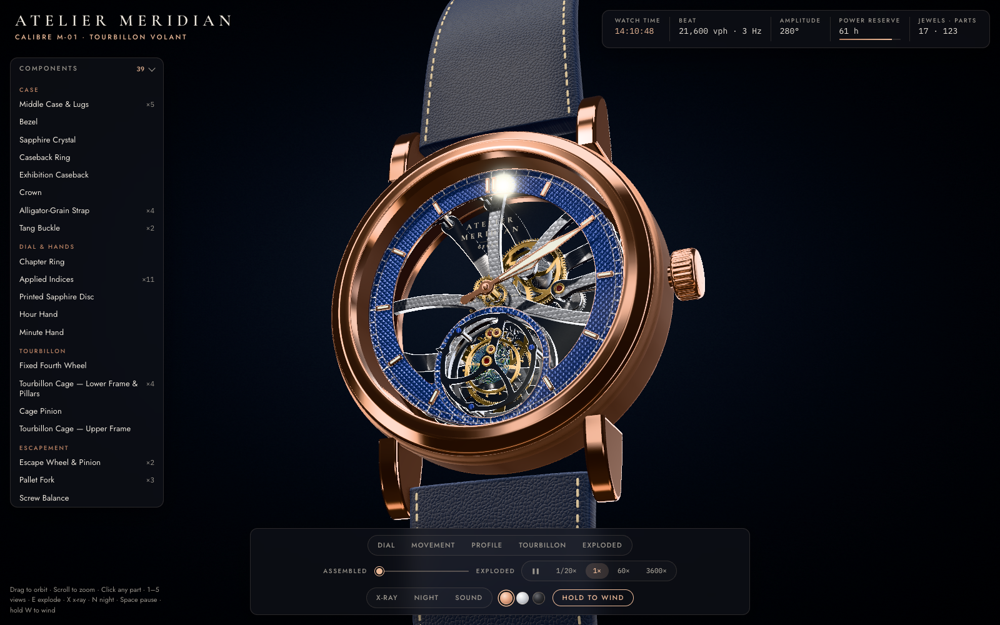

</div>

---

## Highlights

<table>
<tr>
<td width="50%">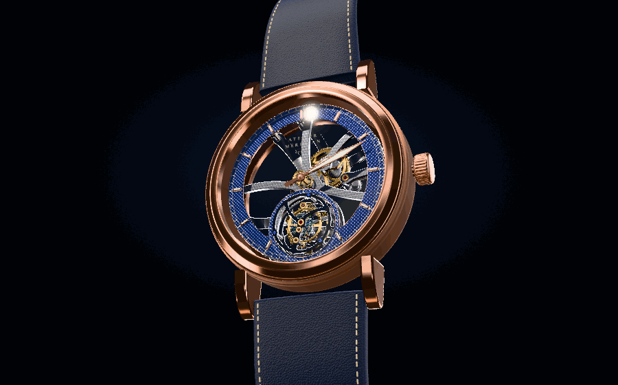</td>
<td width="50%">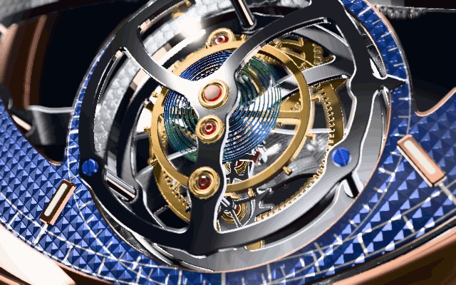</td>
</tr>
<tr>
<td><b>Exploded view.</b> Three dozen sub-assemblies separate along the axis in a staggered order, and the gear train keeps running while they float apart.</td>
<td><b>Flying tourbillon in slow motion.</b> The balance swings ±280°, the blue hairspring coils and uncoils, and the whole escapement rotates inside its cage.</td>
</tr>
</table>

- **Real kinematics.** One module turns simulated time into the angle of every moving part through the true tooth counts. A self-test checks the ratios and periods each time the app starts in development.
- **A modelled Swiss lever escapement.** The pallet fork follows the balance's impulse jewel through the lift angle and then rests on its banking pins. The escape wheel recoils, receives impulse and drops half a tooth, and that drop is what advances the whole train by exactly 1° of cage rotation per beat.
- **Procedural finishing.** Côtes de Genève stripes, perlage, clous de Paris guilloché and circular graining are all generated as normal and roughness maps at startup. The page also includes ruby jewels in polished gold settings, heat-blued screws with their slots aligned, and a hand-stitched leather strap.
- **Click any part to inspect it.** Each part has an encyclopedia card with its tooth count, live speed and material, plus **Isolate**, which turns everything else into a blueprint ghost, and **Follow**, which rides the camera along with a moving part.
- **Live controls.** Speed runs from pause through 1/20× and 1× up to 3600×. There are also X-ray, a Night mode where the lume glows, three case metals, crown winding with a working ratchet and click, a power reserve that runs down, and synthesized tick-tock audio.
- **Fast start.** The app loads in about 2 seconds and needs no external assets. It adapts render quality on slower GPUs, and the layout works on a phone.

## Gallery

| | |
|:--:|:--:|
| 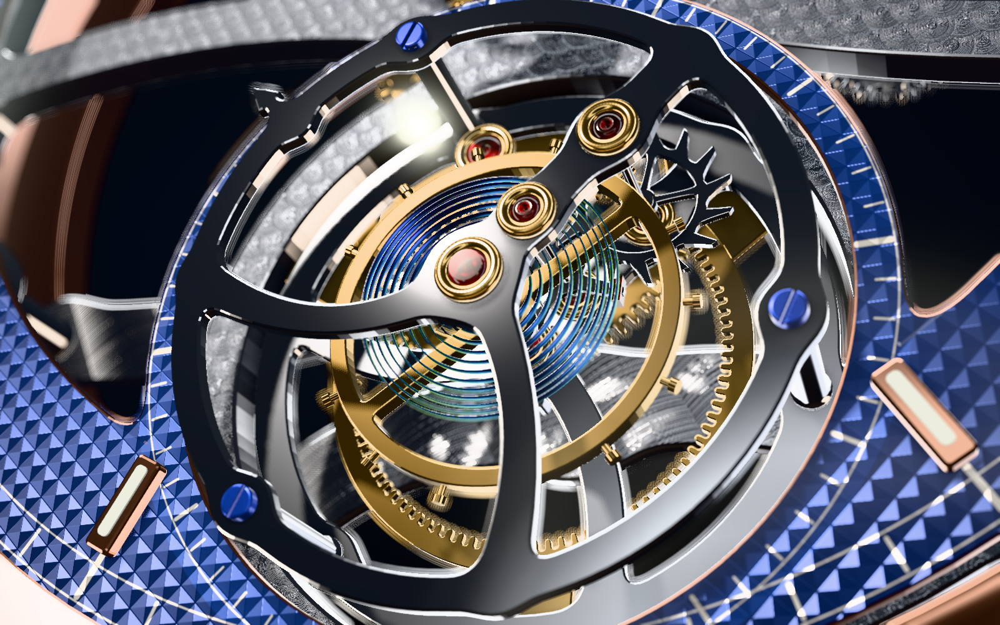 | 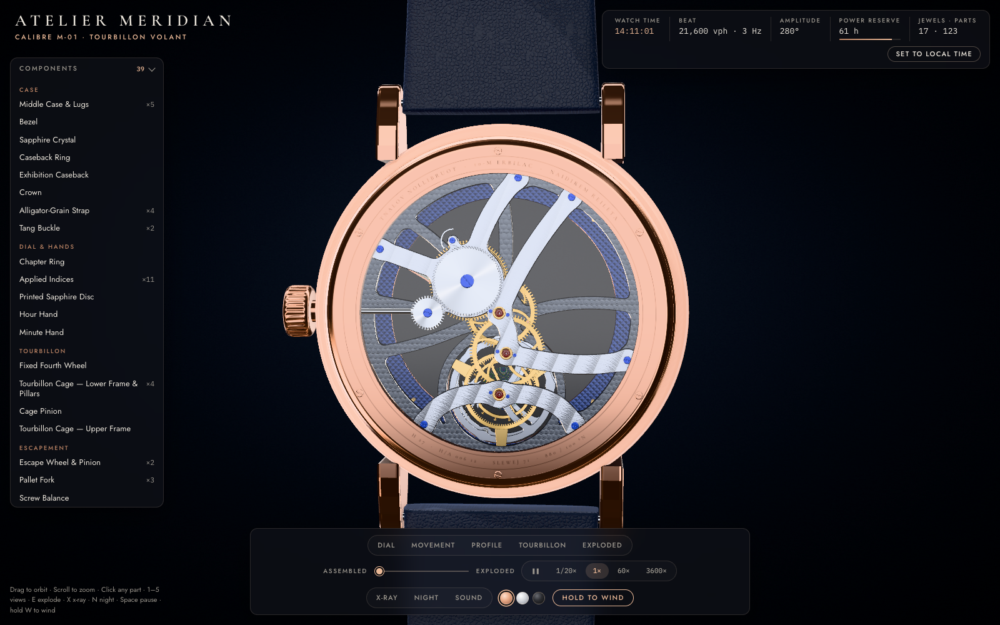 |
| **Macro, with depth of field.** Titanium cage, gold chatons, iridescent hairspring | **Through the caseback.** Rhodium bridges with Côtes de Genève, ruby jewels, ratchet and crown wheel |
| 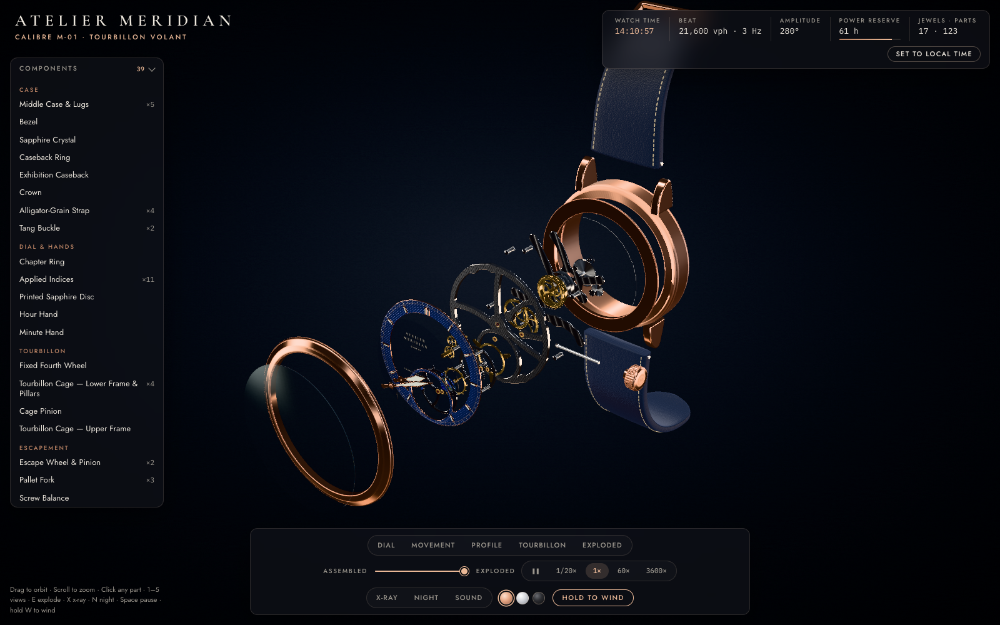 | 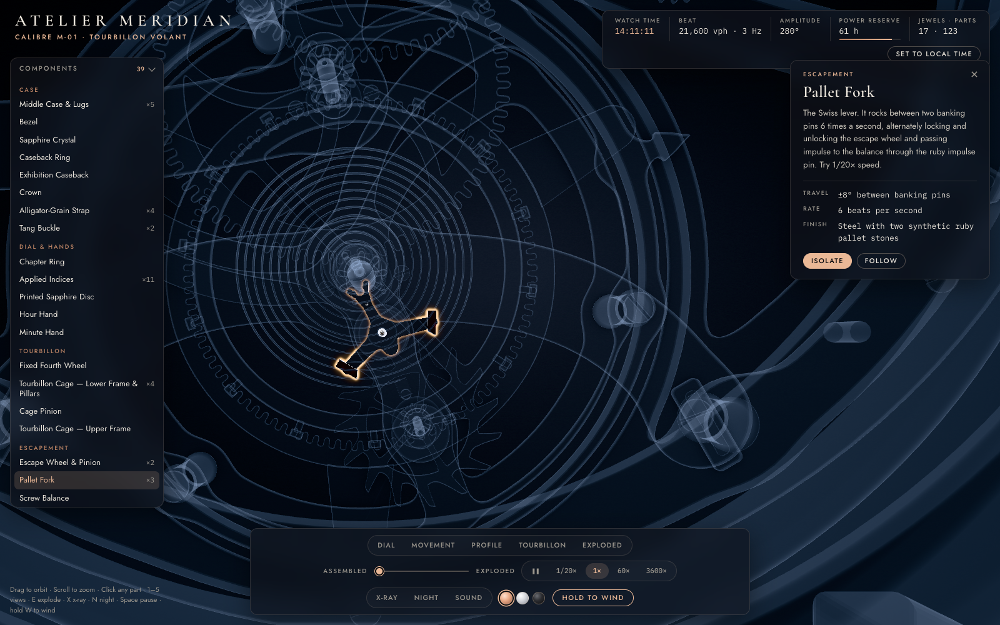 |
| **Exploded view.** Crystal, bezel, dial, motion works, plate, train, bridges and case | **Isolate.** The pallet fork and its two ruby pallet stones |
| 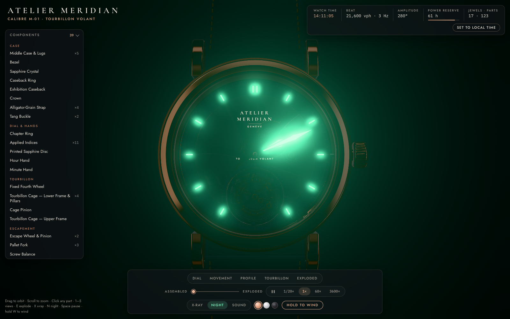 | 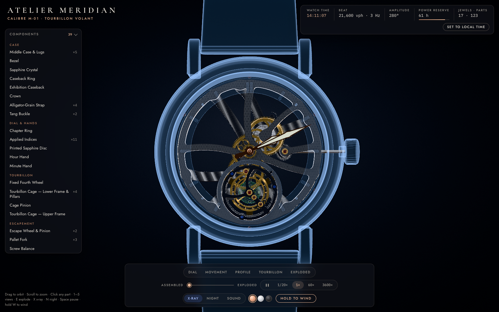 |
| **Night mode.** The lume on the hands and indices glows through bloom | **X-ray.** The case and dial fade to a fresnel ghost |

<p align="center">
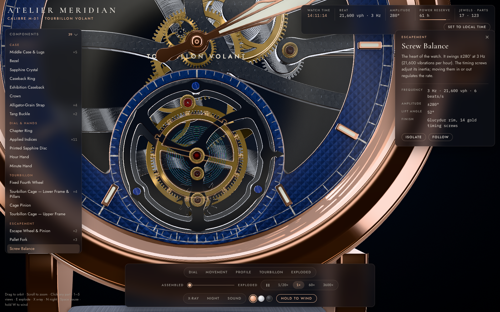
&nbsp;
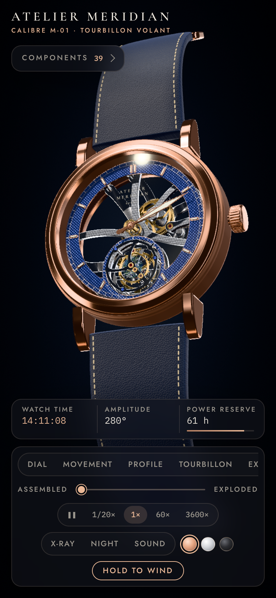
</p>

## The movement in numbers

| | |
|---|---|
| Frequency | **21,600 vph**: 3 Hz balance, 6 beats per second |
| Amplitude | ±280°, falling slightly as the mainspring runs down |
| Tourbillon | Flying (no upper bridge), 1 revolution per minute, Ø 11.9 mm |
| Power reserve | 72 hours, wound through a working crown, ratchet and click |
| Jewels / components | 17 / 123, counted from the model itself |
| Case | Ø 42 mm, 10.8 mm thick, domed sapphire crystal, sapphire exhibition back |

**The gear train.** Wheel positions are solved from exact centre distances, `d = m·(z₁+z₂)/2`, so every pair genuinely meshes.

```
barrel 80T ─▶ centre pinion 10     (barrel: 1 rev / 8 h)
centre wheel 72T ─▶ third pinion 10     (centre: 1 rev / h, carries the minute hand)
third wheel 75T ─▶ cage pinion 9       (cage: 1 rev / min, its arm is the seconds hand)
fixed ring 96T (internal) ◀─ escape pinion 8 rolls inside it   (escape wheel: 12 rev/min relative to the cage)
escape wheel 15 club teeth × 2 beats × 12 = 360 beats per cage turn = 1° per beat
motion works: cannon 12 ─▶ minute wheel 36 / minute pinion 10 ─▶ hour wheel 40   (1 : 12)
```

## Controls

| Input | Action |
|---|---|
| Drag / scroll / right-drag | Orbit / zoom / pan |
| Click a part, or a row in **Components** | Open its card and fly the camera to it |
| `1` to `5` | Dial · Movement · Profile · Tourbillon macro · Exploded views |
| `E` / `X` / `N` | Explode · X-ray · Night |
| `Space` | Pause and resume |
| Hold `W` or **Hold to wind** | Wind the crown |
| `Esc` | Deselect |

## Getting started

```bash
git clone https://github.com/RealTube/calibre-m01-tourbillon.git
cd calibre-m01-tourbillon
npm install
npm run dev          # http://localhost:5173
```

| Script | What it does |
|---|---|
| `npm run dev` | Dev server with hot reload. It also runs the kinematics self-test and prints the result as a table in the browser console. |
| `npm run build` | Production build into `dist/` (about 200 KB gzipped). |
| `npm run artifact` | Builds, then inlines everything into a single self-contained `dist/artifact.html`. |
| `npm run deploy` | Builds and publishes `dist/` to GitHub Pages. |

WebGL 2 is required. It works in any recent desktop or mobile browser.

## How it's built

```
src/
├── main.js                  boot sequence, intro, selection, modes, render loop, adaptive quality
├── movement/
│   ├── layout.js            tooth counts, modules, solved wheel positions, Z stack
│   ├── kinematics.js        simulated time → every angle; escapement model; self-test
│   └── calibre.js           assembles ~180 meshes, registers parts and explode nodes
├── geometry/
│   ├── sdf2d.js             2D signed-distance toolkit + marching squares → THREE.Shape
│   ├── gear.js              ogival wheel teeth, pinion leaves, curved crossings, escape wheel, ratchet
│   ├── bridges.js           main plate, bridges and cage frames designed as smooth SDF unions
│   ├── balance.js           screw balance + "breathing" hairspring vertex shader
│   ├── escapement.js        Swiss lever pallet fork with pallet stones
│   ├── case.js · dial.js · strap.js · details.js
├── materials/               procedural finishes (canvas/DataTexture) and the PBR material library
├── scene/                   renderer + post-processing, HDR studio lighting
├── interaction/             camera rig, picking, exploder
├── audio/tick.js            synthesized tick-tock and ratchet click (WebAudio)
└── ui/                      HUD and styles
```

**[docs/ARCHITECTURE.md](docs/ARCHITECTURE.md)** is the technical deep dive: how the SDF bridges are generated and contoured, the escapement math, mesh phasing, the render pipeline, and the performance work that took load time from 15 s to under 2 s.

**[docs/HOROLOGY.md](docs/HOROLOGY.md)** explains how a mechanical watch and a tourbillon work, mapped to what you see on screen.

## Tech

- **[three.js](https://threejs.org) r186** with `WebGLRenderer`. `MeshPhysicalMaterial` provides transmission for the rubies, anisotropy for the brushed and grained metal, sheen for the leather, and clearcoat.
- **Post-processing:** 4× MSAA in a half-float target, then GTAO ambient occlusion, an outline pass for hover and selection, bloom for the lume, bokeh depth of field for macro shots, and Khronos PBR Neutral tone mapping.
- **HDR studio lighting:** strip softboxes, a ring light and kickers, rendered once into a PMREM environment map. It's the same trick product photographers use to get long highlights on polished metal.
- **[Vite](https://vite.dev)** for development and bundling. There is no UI framework; the whole app is about 4,500 lines of vanilla JavaScript and CSS.

## Notes

*Atelier Meridian* is a fictional brand, and Calibre M-01 is an original design. It is not a replica of any real watch. The mechanism follows real horological principles, simplified where a real movement would need parts that are invisible on screen, such as the setting mechanism, shock protection and the mainspring slipping bridle.

## License

[MIT](LICENSE) © 2026 Gevorg Yeranosyan
