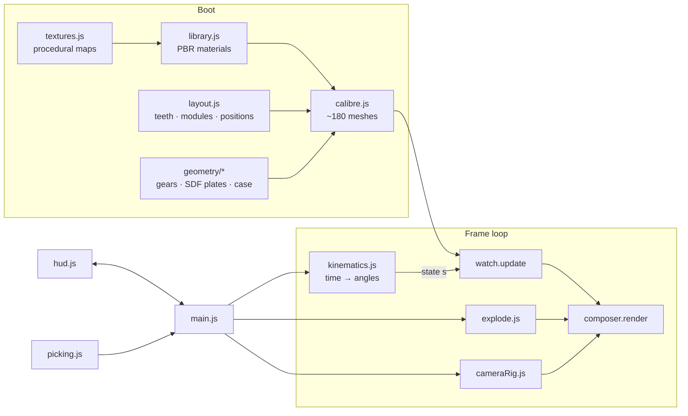

# Architecture

This is a technical tour of how Calibre M-01 is generated, animated and rendered. Everything described here lives in `src/`, and every figure below comes from the running code.

- [1. Data flow](#1-data-flow)
- [2. Layout: solving a gear train](#2-layout-solving-a-gear-train)
- [3. Kinematics: one clock drives everything](#3-kinematics-one-clock-drives-everything)
- [4. Geometry](#4-geometry)
- [5. Materials and procedural finishes](#5-materials-and-procedural-finishes)
- [6. Rendering pipeline](#6-rendering-pipeline)
- [7. Interaction](#7-interaction)
- [8. Performance](#8-performance)
- [9. Testing](#9-testing)

---

## 1. Data flow



`main.js` owns the application state: the selection, isolate, X-ray, night mode and speed. Every frame it runs one `step()`:

1. `kin.update(realDt)` advances simulated time and recomputes every angle.
2. `watch.update(kin.s)` writes those angles into the scene graph.
3. The exploder, night-mode fade, depth of field and camera view offset are advanced.
4. The camera rig updates, the key light follows the camera, and picking raycasts at most once per frame.
5. `composer.render()` draws the frame.

---

## 2. Layout: solving a gear train

`movement/layout.js` is the single source of dimensional truth. It holds tooth counts, gear modules and the Z stack (in millimetres, with +Z toward the dial).

The centre distance of two meshing gears is fixed by their module and tooth counts:

```
d = m · (z₁ + z₂) / 2
```

The centre wheel sits at the origin, carrying the hands, and the tourbillon axis is fixed at 6 o'clock (0, −9). The **third wheel** has to mesh with the centre wheel's pinion *and* the cage pinion. It therefore lies on the intersection of two circles, and `circleIntersect()` solves for it. The barrel and the crown wheel are placed the same way.

| Pair | Module | Centre distance |
|---|---|---|
| barrel 80 → centre pinion 10 | 0.11 | 4.95 mm |
| centre wheel 72 → third pinion 10 | 0.11 | 4.51 mm |
| third wheel 75 → cage pinion 9 | 0.11 | 4.62 mm |
| fixed ring 96 (internal) ↔ escape pinion 8 | 0.08 | 3.52 mm (orbit radius) |
| cannon pinion 12 → minute wheel 36 | 0.08 | 1.92 mm |
| minute pinion 10 → hour wheel 40 | 0.0768 | 1.92 mm (same axes, so the module is solved) |
| ratchet 76 → crown wheel 36 | 0.10 | 5.60 mm |

Wheels that overlap in plan view are kept on separate Z levels. The centre wheel runs above the barrel, and the third wheel runs below the centre wheel. That is how a real movement packs a train into a 32 mm circle.

---

## 3. Kinematics: one clock drives everything

`movement/kinematics.js` converts **simulated time `T`** (seconds since local midnight) into a state object `s` holding every angle. Nothing else in the app animates on its own.

### Balance

```
B = 6·T                  beats (21,600 vph = 6 beats/s)
θ = A · sin(π·B)         balance angle; it crosses zero once per beat
```

The amplitude `A` is 280° at full wind. It falls toward about 175° as the power reserve drains, while the frequency stays constant (isochronism).

### Swiss lever escapement

The escapement is modelled *geometrically* rather than as a timer:

- **Pallet fork.** While the impulse jewel is inside the fork notch (|θ| < 26°, half the 52° lift angle), the fork follows it linearly. Outside that zone it rests on a banking pin at ±8°. The formula is `fork = −8° · clamp(θ / 26°, −1, 1)`, and it needs no state at all.
- **Escape wheel.** Fork progress `p ∈ [0, 1]` through the lift zone drives a three-phase profile:
  1. **Unlocking.** A small recoil as the pallet stone slides off the tooth (`p < 0.22`).
  2. **Impulse.** The tooth pushes the pallet's impulse face (`p < 0.86`).
  3. **Drop.** The wheel jumps free until the other pallet stone catches it.
- The cumulative "train position" `A = k − 1 + profile(p)` (in beats, where `k` is the current beat) is the **only** input to the rest of the movement. The train therefore advances in the discrete steps a real watch makes.

### Tourbillon

The cage turns 1° per beat, so 360 beats make one minute:

```
cage   = −A · 1°
escAbs = meshAngleInternal(0, 96, 8, cage)     // escape pinion rolling inside the fixed ring
escape = escAbs − cage                           // relative to the cage: +12 rev/min
```

A planet rolling inside a fixed ring turns `(1 − z_ring/z_planet)` times per carrier revolution. Relative to the carrier that is `−z_ring/z_planet = −12`, so 12 escape-wheel turns × 15 teeth × 2 beats = 360 beats per cage turn. That is exactly what the escapement needs.

### Mesh phasing

A ratio alone doesn't make teeth interlock. The *phase* has to be right too. For external gears:

```js
meshAngle(a, zA, zB, line) = line + π + π/zB − (zA/zB)·(a − line)
```

When a tooth of A points along the line of centres, a **gap** of B faces it. The internal-gear version uses `+ (zA/zB)` and no `π` term. Every wheel angle is computed from its driver's actual angle, so teeth stay interlocked at every frame and every speed.

The escape wheel's teeth are phased on their arbor so that, at rest, a tooth's locking corner sits against the engaged pallet stone.

### Hands, winding and power

- The minute and hour hands are friction-fitted in a real watch, so they take the exact time `−2π·T/3600` and `−2π·T/43200`. The motion-works wheels still run through true 12:36 and 10:40 meshes.
- Winding rotates the stem. That drives the winding pinion, then the contrate wheel, then the crown wheel, then the ratchet. Each ratchet tooth fires a `click` event, which drives both the pawl animation and the click sound.
- Power drains at simulated speed. At 3600× a full 72 h reserve lasts 72 seconds. At zero the train stops, the balance decays, and **Wind** restarts it from where it stopped, just like a real watch.
- Above 8× the escapement switches to continuous motion so it doesn't strobe. The balance then swings on a real-time clock.

---

## 4. Geometry

### Horological gear teeth: `geometry/gear.js`

Watch wheels don't use the involute teeth of machinery. `toothOutline()` builds:

- **wheels** with radial flanks, an ogival (pointed-arch) addendum `r + h·sin(t)^0.72`, and rounded roots;
- **pinions** with deep, semicircular-tipped leaves;
- **internal** teeth for the fixed fourth wheel, by swapping the tip and root radii.

The wheels' **curved crossings** are sampled spoke-window paths that sweep with radius. Their corners are rounded by two Chaikin subdivision passes, and the windows are then used as holes. The **escape wheel** has 15 "club" teeth: a concave back, an inclined impulse plane, and a locking face leaning forward in the direction of rotation.

Every part is an `ExtrudeGeometry` with a micro-bevel whose `bevelOffset = −bevel` keeps the nominal outline. Extrude geometry has two groups (caps and flanks), so faces and edges get different materials. That is how the polished bevels (*anglage*) are done.

### SDF-designed plates: `geometry/sdf2d.js` + `geometry/bridges.js`

The main plate, bridges, tourbillon frames, pallet fork, hands, balance and dial are drawn with a **2D signed-distance toolkit**. The primitives are circles, rings, capsules, tapered capsules, arcs, Bézier strokes, boxes and polygons. They are combined with union, smooth union, subtraction and intersection. Smooth union gives every junction a natural hand-filed fillet.

Outlines are extracted by **marching squares**, which is consistent in winding, disambiguates saddle cells, and builds edge-keyed loops. The loops are simplified with Ramer–Douglas–Peucker and then classified as outlines or holes by containment depth. The result is a set of `THREE.Shape`s with holes, ready to extrude.

### The breathing hairspring: `geometry/balance.js`

The hairspring is a 12-turn Archimedean ribbon, 0.028 × 0.14 mm in section. Each vertex carries `aT`, running from 0 at the stud (fixed to the cage) to 1 at the collet (turning with the balance). A vertex-shader patch added through `onBeforeCompile` rotates each vertex by `θ·aT` and scales its radius by `1 − k·θ·sin(π·aT)`. The coils visibly open and close with every swing, while both ends stay attached.

### Mainspring

The mainspring is a CPU-built spiral ribbon. Its radius profile blends between *let down* (packed against the drum wall) and *wound* (packed around the arbor), driven by the power reserve.

### Case, dial and strap

- **Case:** lathe-turned profiles with rounded corners, so the lathe normals read as polished radii. The lugs are profile extrusions. The crown has vertex-displaced flutes, with the seam welded by `mergeVertices`.
- **Dial:** a chapter ring fused with the tourbillon's seconds track by a smooth SDF union. Canvas-printed minute tracks are mapped through the planar UVs of the extrusion caps.
- **Strap:** a superellipse cross-section swept along a curve that runs straight off the lugs and then bends around a wrist. The saddle stitching is one `InstancedMesh`.

---

## 5. Materials and procedural finishes

All finishes are generated at startup in `materials/textures.js`, as height fields converted to tangent-space normal maps.

| Finish | Where | Technique |
|---|---|---|
| **Côtes de Genève** | Bridges | Parallel bands shaped like shallow cylinders, with arched strokes `v = y + x²/2R` and micro-scratches; diagonal and continuous across all bridges |
| **Perlage** | Main plate | Hundreds of overlapping spots, each with concentric grooves, painted in order so later spots overlap earlier ones |
| **Clous de Paris** | Dial | A pyramid (hobnail) height field, rotated 45° |
| **Circular graining** | Wheels, ratchet | Concentric micro-grooves plus a tangential **anisotropy direction map**, fitted per wheel radius |
| **Leather grain** | Strap | Tileable Worley (F2 − F1) cells |

The material highlights (`materials/library.js`):

- **Ruby jewels:** `transmission` with IOR 1.77 and red attenuation.
- **Sapphire crystal:** an *additive* reflection layer with an iridescent AR tint. Transmissive glass in three.js can't see other transmissive objects, so a transmissive crystal would hide the rubies beneath it.
- **Heat-blued screws:** deep cobalt metal with a clearcoat and blue sheen.
- **Brushed case flanks:** anisotropy rotated along the lathe profile.
- **X-ray and isolate:** a fresnel ghost `ShaderMaterial`.

---

## 6. Rendering pipeline

```
RenderPass → GTAOPass → OutlinePass → UnrealBloomPass → BokehPass → OutputPass
(MSAA 4×, half float)                  (night only)   (macro only)  (PBR Neutral)
```

- **Lighting (`scene/studio.js`).** Emissive "lightformers" (strip softboxes, a ring light, kickers and a large rear softbox) are rendered once into a PMREM environment. A shadow-casting key light rides with the camera, so self-shadowing always reads.
- **Glass and prints stay out of the depth buffers.** GTAO and bokeh both re-render the scene for depth. Their `render()` methods are wrapped so that glass and printed decals are hidden during those passes, which keeps occlusion and focus on the parts beneath.
- **The rubies sample a half-resolution copy of the scene** (`transmissionResolutionScale = 0.5`).
- **Bloom runs only in Night mode.** In daylight it produced a haze around specular highlights, so it is switched off.

---

## 7. Interaction

- **Camera (`interaction/cameraRig.js`).** OrbitControls plus fly-to tweens interpolated in *spherical* coordinates, with a log-lerped radius and the shortest way around. Paths arc around the watch instead of cutting through it. Presets are framed by a fitted radius, so they compose correctly at any aspect ratio.
- **Selection framing.** The camera looks from whichever side the part lives on. `camera.setViewOffset` slides the part clear of the info card: sideways on desktop, upward on phones.
- **Picking (`interaction/picking.js`).** At most one raycast per frame. It ignores glass, prints and ghosted meshes.
- **Exploder (`interaction/explode.js`).** A single progress value drives every node through `ease((p − delay·0.42) / 0.58)`. The delay is inversely proportional to how far each part travels, so the outer parts leave first.
- **Audio (`audio/tick.js`).** Each beat is two band-passed noise transients 4.5 ms apart (lock, then drop) plus two inharmonic steel partials. The "tick" and "tock" differ slightly, as the entry and exit pallets do in a real watch.

---

## 8. Performance

| Change | Effect |
|---|---|
| Allocation-free segment distance in the SDF evaluator | Removed about 100 M short-lived objects |
| Bounding-box early-out for Bézier strokes | Far samples skip 24 segment tests |
| Coarse-to-fine sampling (4× grid, exact values only near the outline) | Main plate 2409 → 127 ms, train bridge 1763 → 28 ms |
| **Total geometry build** | **≈ 9 s → ≈ 0.7 s** |
| Pixel ratio capped at 1.6, transmission at half resolution, quarter-resolution bloom, bloom only at night | About 2× frame rate on high-DPI screens |
| Adaptive quality (pixel ratio 1.25, then GTAO off, then pixel ratio 1) when frames exceed 24 ms | Stays fluid on integrated GPUs |

The watch keeps true time regardless of frame rate. Simulation time advances by real elapsed time, up to 60 s per frame, and a `visibilitychange` handler catches up on time spent in a background tab.

---

## 9. Testing

- **Kinematics self-test.** In development, `kin.selfTest()` runs on boot and prints a table in the console. It asserts the cage (1 rev/min), escape wheel (12 rev/min relative to the cage), third/cage ratio, centre wheel (1 rev/h), barrel, both hands, the motion works, 360 beats per cage turn, and agreement with the wall clock.
- **Deterministic stepping.** Also in development, `window.__app.run(seconds)` advances the full frame loop by fixed steps. This makes headless screenshots and GIF captures reproducible, even when the tab is hidden and `requestAnimationFrame` is paused. All the media in `docs/media` was captured this way with headless Chrome.
