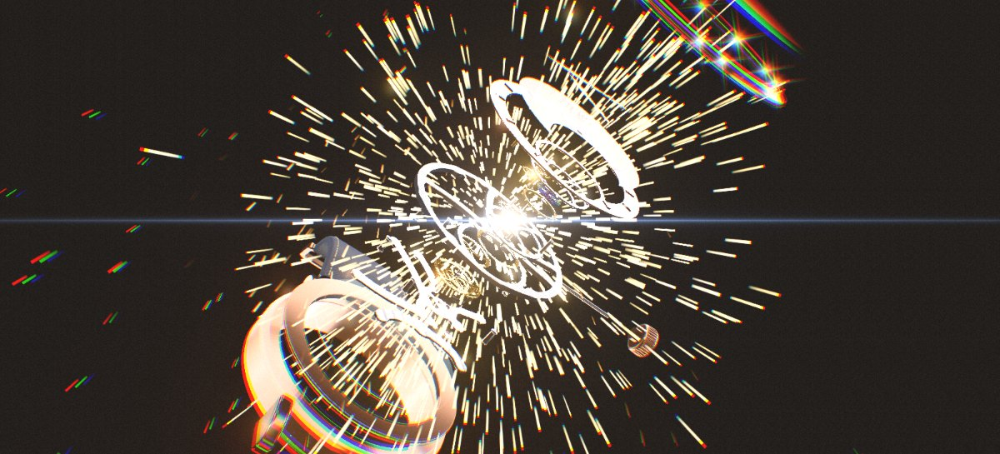
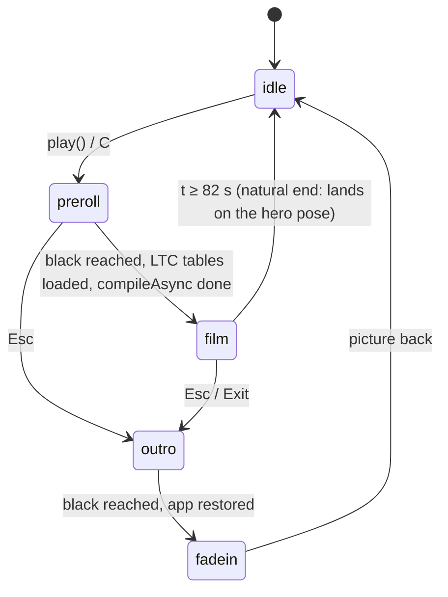
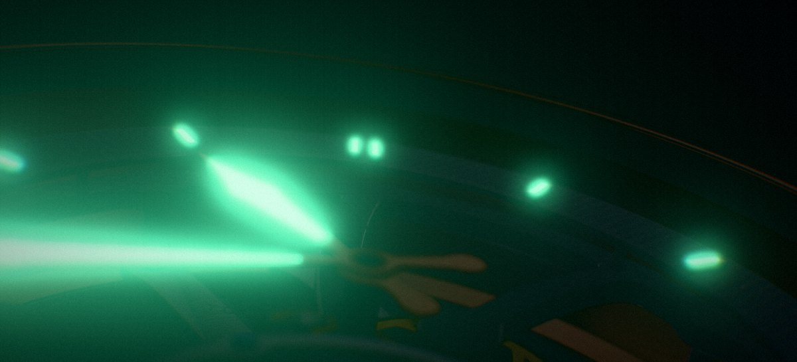
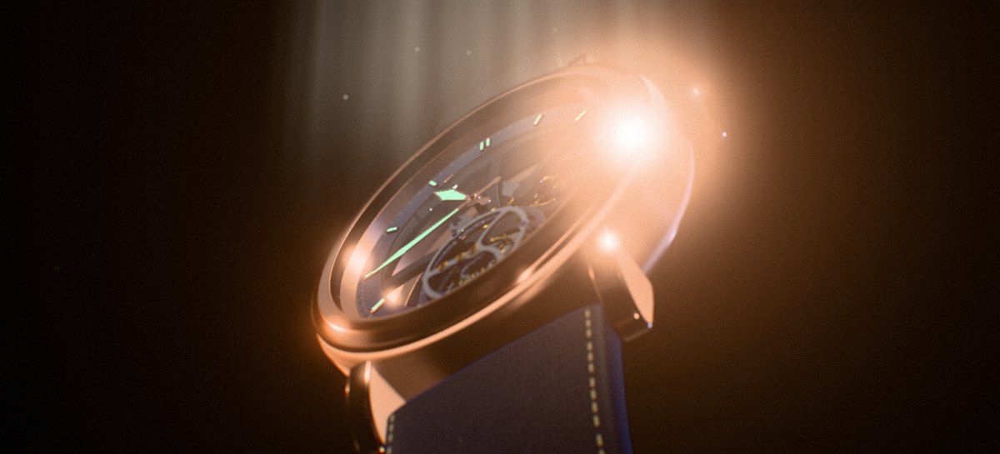
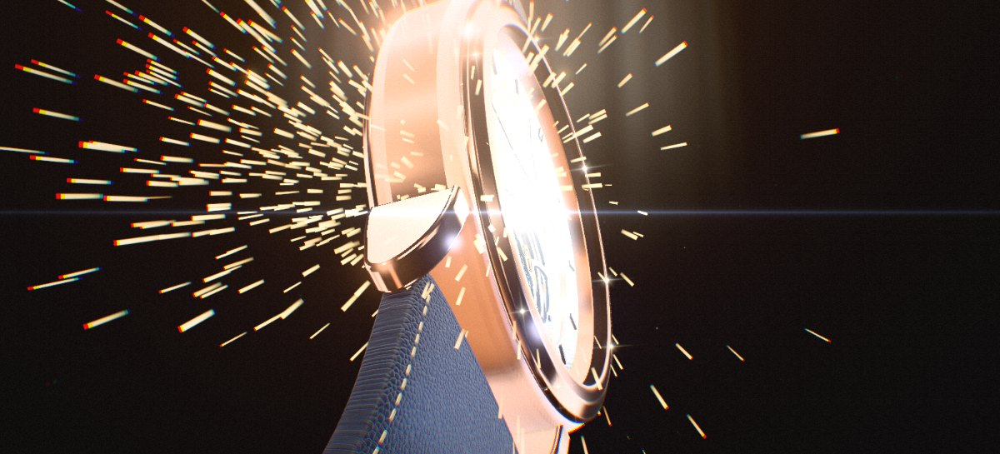
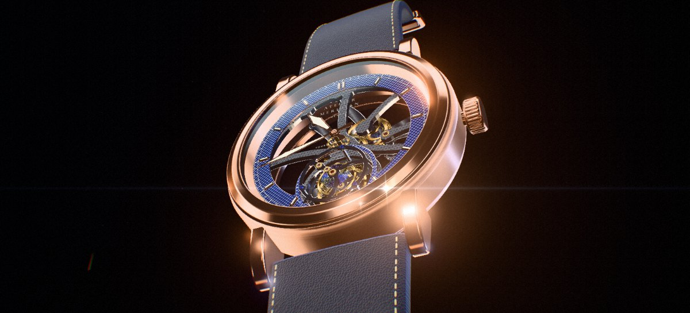
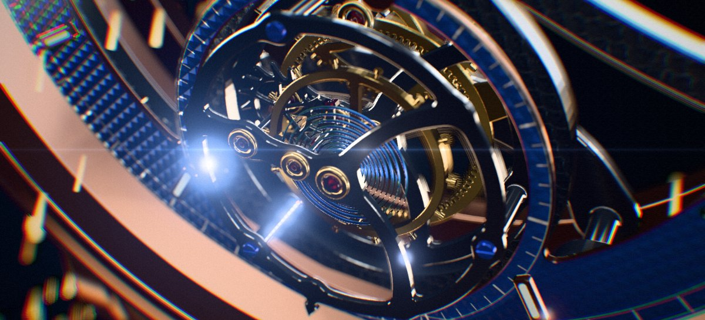
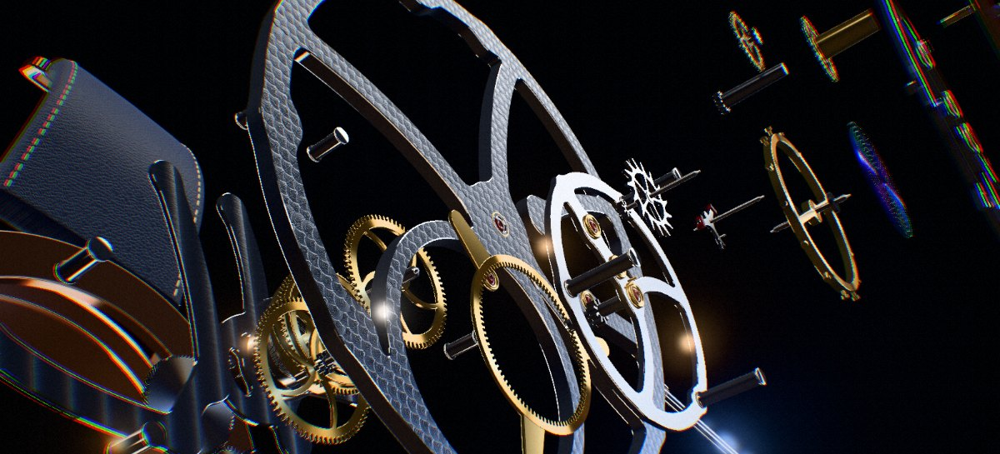
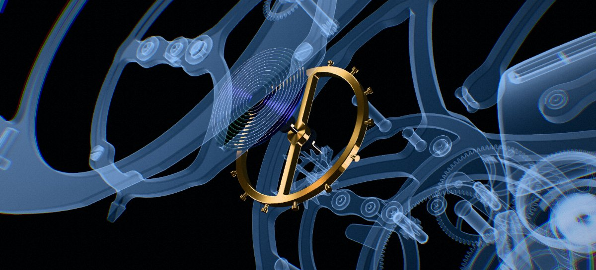
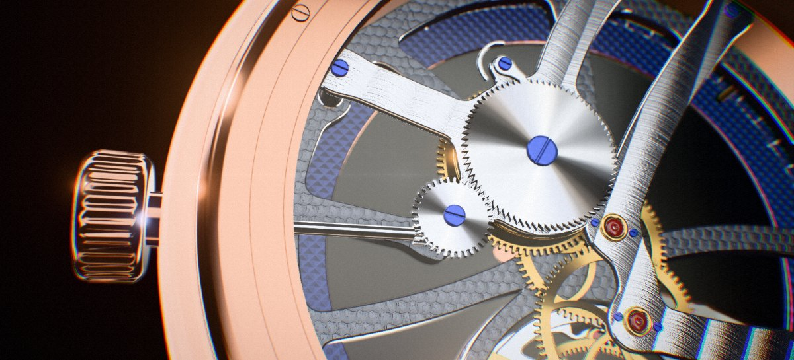

# The film

This page documents **Play film**, the 82-second trailer that runs on the live model. It covers what is on screen, which file controls each part, and how to change it without breaking anything. Everything lives in `src/cinematic/`. Nothing is pre-rendered: every frame is the same watch you can click on in the app.



- [1. Using it](#1-using-it)
- [2. Files](#2-files)
- [3. How it runs](#3-how-it-runs)
- [4. The timeline, shot by shot](#4-the-timeline-shot-by-shot)
- [5. Editing recipes](#5-editing-recipes)
- [6. The contract with main.js](#6-the-contract-with-mainjs)
- [7. Testing and tuning](#7-testing-and-tuning)
- [8. Gotchas we already hit](#8-gotchas-we-already-hit)
- [9. Cost](#9-cost)

---

## 1. Using it

| Input | Action |
|---|---|
| **Play film** (end of the dock's first row) or `C` | Start the film |
| `Esc` or **Exit** | Leave early: fade to black, restore the app, fade back up |
| `M` or **Sound on/off** | Mute or unmute the film |

- **Desktop only.** The button is hidden, and `play()` refuses to start, unless the window matches `(min-width: 821px) and (hover: hover) and (pointer: fine)`. That rule lives in two places that must agree: the `.film` media query in `cinematic.css` and `DESKTOP` in `director.js`.
- **Sound is on by default.** The click on the button unlocks Web Audio.
- **Reduced motion.** Under `prefers-reduced-motion`, shake drops to 25 %, and flash and aberration to 30 %.
- **Hand-back.** When the film ends, the app is exactly as the viewer left it (speed, metal, X-ray, power reserve), except that the camera rests on the hero view and the hands are back on local time.

## 2. Files

| File | What it owns | Edit it to… |
|---|---|---|
| `src/cinematic/shots.js` | **The film as data.** Shots (camera), tracks (light, look, speed, wind), the explode curve, metals, blueprint focus, light sweeps, chords, sound cues, titles, callouts and chapters | change *anything about what happens when*. Most edits happen here. |
| `src/cinematic/director.js` | The engine: phases, timeline clock, applying the tracks, camera shake, the light rig's camera-relative placement, the beat-locked arpeggio, the hand-back | change *how* things are applied, add a new kind of track, change the arpeggio pattern |
| `src/cinematic/fx.js` | The film-only light rig, sparks, dust, beam, star glints, and the `CinemaShader` final grade | change how sparks, glints, beam or grade *look* |
| `src/cinematic/score.js` | The synthesized score: every voice (hit, braam, riser, pad, …) and the master chain | add or change a *sound* |
| `src/cinematic/overlay.js` | The DOM layer: letterbox, titles, lower thirds, chapter, readout, callouts, controls | change how text *behaves* |
| `src/cinematic/cinematic.css` | All film styles, plus the **Play film** button and hiding the app UI | change how text and the button *look* |
| `index.html` | The button markup (with its `1:22` label) and the `#cine` overlay skeleton | rename the button, change the duration label |
| `src/main.js` | Creates the director; `enter()` / `leave()`; the `stage()` / `cine.update()` split in `step()`; input guards | change what the film borrows from or restores to the app |
| `src/audio/tick.js` | `tickAt()` / `clickAt()` / `context`, so the film can schedule the escapement's ticks exactly | (rarely) |
| `vite.config.js`, `package.json` | `npm run artifact` builds in `artifact` mode, which inlines the film's lazily loaded chunk into the single file | (rarely) |

## 3. How it runs



**Per frame**, `main.js` `step()` runs `kin.update`, then `watch.update`, and then either `stage()` (the app's own camera, night fade, DoF, picking) or `cine.update(dt)` while `cine.active`. During the film, `update()` does the following, in order:

1. Advance `t`.
2. Fire every **sound cue** due within the next 150 ms, at its exact AudioContext time.
3. `apply(t)`:
   - set `kin.speed`, `kin.windRate`, every explode node, the case metal and the blueprint focus;
   - solve the current shot's camera, then add handheld drift and impact shake;
   - place the rim, top and sweep lights relative to the camera;
   - set the environment, background, key light, exposure, lume, bloom, depth of field and grade;
   - update the particles and glints, the overlay and the callouts.
4. Fire **visual events** whose time has passed. This happens after the camera is placed, so a spark burst aimed at "the lens" aims at the new shot.
5. `scheduleBeats()`: predict the escapement's next beats and schedule each one's tick and arpeggio note.

## 4. The timeline, shot by shot

The film is cut on a **90 BPM grid**, and 90 BPM = 21,600 vph ÷ 240, so one beat is ⅔ s, or four escapement beats. In code, times are written `b(n)` for beat *n*. The table gives both.

| # | Beats | Seconds | Shot (camera) | Look and watch | Text and effects | Sound |
|---|---|---|---|---|---|---|
| 1 | 0–8 | 0–5.3 | **Darkness.** Grazing push across the dial toward 12, strong DoF | Environment light at 0.012; only the lume glows, with a tight bloom | "Atelier Meridian presents" | Drone fades in; real escapement ticks |
| 2 | 8–14 | 5.3–9.3 | **First light.** Low three-quarter, table-top look | Top spot, beam and dust snap on; strip-light sweep 1 | Star glints ride the highlight; anamorphic flare follows the brightest | Clunk, riser, whoosh, reverse swell |
| 3 | 14–22 | 9.3–14.7 | **Ignition and reveal.** Whip from an edge-on profile round to the face; dutch roll settles | Full studio light, rims on | Two spark bursts, flash, shake; title **Calibre M-01** | **Hit** with braam and shimmer; pad E minor add9 |
| 4 | 22–28 | 14.7–18.7 | **Crown macro.** Track along the flank, rack focus from the crown to the dial | Exposure 0.82; soft sweep | Lower third "Ø 42 mm · 10.8 mm" | Whoosh |
| 5 | 28–36 | 18.7–24 | **I · The Heart.** Spiral dive into the tourbillon | Speed 1× → 1/20× over b31–b33 | Chapter title, lower third, speed readout | Small hit; pad Cmaj7; **arpeggio played by the beats** (E minor) |
| 6 | 36–44 | 24–29.3 | **Escapement macro**, riding with the cage | 1/20× | Callouts: balance, pallet fork, escape wheel | A note on every (slow) tick |
| 7 | 44–54 | 29.3–36 | **Time-lapse.** Pull back to the whole dial | 1/20 → 1 → 60 → 3600×, hard brake to 0 at b53.2–b53.9 | Live ×speed readout; "Every wheel at its true ratio" | Shepard tone and riser; brake drop |
| 8 | 54–60 | 36–40 | **II · Anatomy.** Low silhouette, slow push | Environment light at 0.07, strong rims; `kin.syncToNow()` at b54; parts tremble from b56 | "123 components" counts up | Hit; drone ducks; heartbeats, riser, reverse swell (a near-silence before the hit) |
| 9 | 60–68 | 40–45.3 | **Explosion.** Out-expo burst, camera pulls back to the whole stack | | Three spark bursts, big flash, CA, shake; "No models. No textures." | Biggest hit, long sub drop, shimmer; pad C |
| 10 | 68–82 | 45.3–54.7 | **Fly-through** along the exploded axis, slow barrel roll | Parts float | Callouts: crystal, chapter ring, tourbillon cage, main plate, bridges, ratchet and click | Whoosh; pads C → D; arpeggio C → D |
| 11 | 82–91 | 54.7–60.7 | **Blueprint montage**, 3 × 2 s: balance, Swiss lever, barrel | Everything else becomes the X-ray ghost | Lower thirds | A hit on each cut; pad A minor |
| 12 | 91–98 | 60.7–65.3 | **III · Power.** Reassembly while the camera swings round to the caseback | Inner parts seat first; the last seats at ≈ 64.9 s | Chapter title | A metallic **seat** click per landing, then a hit |
| 13 | 98–105 | 65.3–70 | **Winding** through the sapphire back | Power preset to 38 h, crown at 4.2 turns/s | Power readout, lower third | Real ratchet clicks; pad D |
| 14 | 105–111 | 70–74 | **IV · Metal**, 3 × 1.3 s cuts | Platinum, then black DLC, then 5N rose gold, each with a sweep | Big titles | A hit on each cut |
| 15 | 111–123 | 74–82 | **Finale.** Rise from low and close to *exactly* the app's hero pose | Every track converges on the app's studio values by 81.4 s | Sparks; the **Atelier Meridian** title card | Final hit; E major pad and arpeggio; release at 79.6 s |

| | | |
|:--:|:--:|:--:|
|  |  |  |
| 1 · Darkness | 2 · First light | 3 · Ignition |
|  |  |  |
| 3 · Reveal | 5 · The heart | 9 · Explosion |
|  |  |  |
| 10 · Fly-through | 11 · Blueprint | 13 · Winding |

---

## 5. Editing recipes

### Quick map: "I want to…"

| …change | Where |
|---|---|
| a camera move | the shot's `cam()` in `shots.js` → `shots` |
| when something cuts | `t0` / `t1` of the shots, then follow the [retiming checklist](#retiming-or-adding-a-shot) |
| how bright or dark a moment is | `tracks.env` / `bg` / `key` / `exposure` / `rim` in `shots.js` |
| the strip-light sweeps | `sweeps` in `shots.js` |
| the speed ramps (slow motion, time-lapse) | `speedAt()` in `shots.js` |
| explosion timing or feel | `T_TREM`, `T_BURST`, `T_ASM`, `ASM_SPREAD`, `ASM_TRAVEL`, `explode()` in `shots.js` |
| which parts the blueprint shows | `FOCUS` in `shots.js` |
| the metals montage | `finishAt()` in `shots.js` |
| a title or caption's words or timing | `events` in `shots.js` |
| a callout | `callouts` in `shots.js` |
| a spark burst | the `C.fx.burst(…)` calls in `events` |
| a sound | `cues` in `shots.js` (timing) / `score.js` (the voice itself) |
| the music's chords | `CHORDS` in `shots.js`; the note pattern is `ARPEGGIO` in `director.js` |
| text styling | `cinematic.css` (`.ct-*` titles, `.lt-*` lower thirds, `.co-*` callouts, `.cd-*` readout) |
| the button | markup in `index.html`, style `.film` in `cinematic.css` |
| grain, vignette, flare, aberration | `tracks.grain` / `vignette` / `ca` in `shots.js`; the shader is `CinemaShader` in `fx.js` |

### Cameras

A shot is `{ t0, t1, cam(u, o, s) }`. `u` runs 0 → 1 across the shot, and `s` is seconds into it. `cam` writes into `o`:

| Field | Meaning |
|---|---|
| `pos`, `target` | `THREE.Vector3`, in millimetres |
| `fov` | Vertical field of view in degrees (the app uses 28) |
| `roll` | Dutch angle in degrees, applied after `lookAt` |
| `dof` | 0 = everything sharp, 1 = full depth of field focused on `target` |
| `ap` | Aperture multiplier (1 ≈ the app's tourbillon view) |

Most shots use `orbit(o.pos, target, r, az, el)`:

- **az** is measured in the dial plane from **+X (3 o'clock, the crown)** toward +Y (12). So −90 looks from the 6 o'clock side, and ±180 from 9 o'clock.
- **el** is the height above the dial: 90 is straight at the dial, 0 edge-on, negative behind the caseback.
- The camera's up is world **+Y**. A camera low on the −Y side therefore sees the watch **lying flat, dial up** (the "table-top" product look), while el ≈ 90 shows the dial upright.
- **Avoid** looking straight along ±Y (az ±90 with el ≈ 0): `lookAt` degenerates there.

Useful places, in assembled coordinates (mm):

| What | Where |
|---|---|
| Watch centre / hero target | `(0, -1.5, -1)` (`HERO_T`) |
| Tourbillon centre | `(0, -9, 1.6)` (`TB`) |
| Crown | x ≈ 20.4–24.4, y 0, z −1.3 |
| Ratchet (back side) | `(3.5, 3.5, -4.3)` |
| Case radius / thickness | ≈ 21 / 10.8; crystal top at z ≈ 5, caseback at z ≈ −5.8 |
| Escapement, in the cage frame | balance at the origin, pallet fork at x 1.44, escape wheel at x 3.52 |

When a part moves (cage, balance, fork), use `at(object, x, y, z)`. It returns that local point in world space at this frame; shot 6 rides the cage this way. The exploded offsets come from `explode(g, offset)` in `movement/calibre.js`. The stack runs from the crystal (z ≈ +67) through the dial (+25), tourbillon cage (+8 to +22), main plate (−1), bridges (−24), ratchet (−31) and caseback (−38) to the middle case (−52).

**Framing math.** At fov 28, the visible height is ≈ 0.5 × distance. The whole watch wants about 100–150 mm, the tourbillon cage about 30–40, and the escapement about 20–25. The letterbox keeps the middle 2.2 : 1 of the screen, so frame tighter vertically than you would in the app.

**Shake and drift** come from the director, not the shots. `tracks.handheld` sets the drift in degrees. `C.kick({ trauma })` adds impact shake that decays and is applied as trauma² (smooth noise, not jitter).

### Retiming or adding a shot

Shots must **tile the timeline with no gaps**, and a hard cut is simply the next shot starting. When you move a boundary or add a shot, also check each of these, because they all refer to film time:

1. `shots` (`t0` / `t1`), and `duration = b(123)` if the length changes
2. `tracks` (every `seq` with a time in that range)
3. `speedAt()`, `finishAt()`, `FOCUS`, `T_TREM` / `T_BURST` / `T_ASM`
4. `sweeps`, `CHORDS`
5. `cues` (sounds), `events` (titles, bursts, flashes) and `callouts` (`t0` / `t1`; flythrough callouts derive from `z`)
6. `chapters` (ticks on the progress line) and the `C.ui.chapter(…)` events
7. If the length changes: the `1:22` label in `index.html` and the "82-second" mentions in `README.md`, `docs/ARCHITECTURE.md` and this file

Keep the hand-back intact. The last shot must end on `heroPos` / `heroTarget`, and the `END` ramps must reach the app's own studio values (environment 1, background 1, key 1.7, exposure 1.05, bloom 0, rims 0, grade 0). Otherwise the last frame "pops" when the app takes over.

### Light and look (`tracks`)

`seq(v0, [t, v], [t, v, dur, ease])` holds `v0`. From each time `t` the value becomes `v`, either at once (a cut) or by ramping over `dur` seconds with an easing from `E`. Changes must be in time order.

| Track | Drives | App value | Film range |
|---|---|---|---|
| `fade` | black over the picture | — | 1 → 0 in the first 2.5 s |
| `env` | `scene.environmentIntensity` (the softbox reflections) | 1 | 0.012 in the dark, 0.07 tension, 0.7 blueprint, 1 studio |
| `bg` | `scene.backgroundIntensity` | 1 | 0–0.14, a near-black void |
| `key` | the key light that rides with the camera | 1.7 | 0–1.6 |
| `exposure` | tone-mapping exposure | 1.05 | 0.82–1.15 |
| `lume` | lume emissive intensity | 0 (3.4 at night) | 2.2 → 0 in the opening |
| `bloom`, `bloomThreshold`, `bloomRadius` | UnrealBloom | off | Low threshold only in the dark. **Keep the threshold ≥ 5 in lit shots**, or polished gold glows like a bulb |
| `rim` | warm and cool rim spots | — | 0–3.2 |
| `top`, `beam`, `dust` | the opening beam | — | only shots 2–3 |
| `vignette`, `grain`, `contrast`, `ca` | the final grade | 0 | ≈ 0.4, 0.045, 0.14, 0.28 |
| `handheld` | camera drift, degrees | — | 0.12–0.24 |
| `wind` | `kin.windRate`, crown turns/s | 0 | 4.2 in shot 13 |

The rims are placed by the director: behind the watch, wide (±95 along camera-right) and fairly low. The crystal is almost flat (a 3.6° dome), so a rim placed high behind the watch mirrors straight into the lens as a large glare.

**Sweeps** are entries in `sweeps`: `[t0, t1, peak, height, dist, from, to]`.

- The strip sits `dist` mm in front of the target, `height × dist` above it in camera-up, and travels from `from × dist` to `to × dist` along camera-right.
- `±1.2` crosses the whole frame, and intensity follows a sine bell.
- Peaks of 2.5–6 suit lit shots; 11 is only for the dark first-light shot.
- One sweep at a time. The glints and the flare follow it automatically.

### The watch: speed, explosion, metal, blueprint

- **`speedAt(t)`** returns `kin.speed` (1 = real time). Interpolate between speeds exponentially (`expLerp`) so ramps feel even. Above 2× the beats stop ticking, and above 8× the kinematics switch to continuous motion (see `kinematics.js`). The film also sets `kin.power = 60` at the start, so the time-lapse can't run the watch down; the viewer's own value comes back at the end.
- **`explode(t, n, i)`** returns each explode node's progress (0 = assembled, 1 = exploded).
  - Tremble from `T_TREM`, then the burst at `T_BURST`. Outer parts go first, staggered by `n.delay`, with an out-expo curve and a gentle float.
  - Reassembly starts at `T_ASM`, inner parts first. Each node begins `(1 − delay) × ASM_SPREAD` after `T_ASM + 0.3` and travels for `ASM_TRAVEL` seconds with an ease-in, so it *snaps* into place.
  - The landing times are computed and become **seat** sound cues, so changing these constants re-times the clicks automatically.
- **`finishAt(t)`** returns `'rose' | 'platinum' | 'dlc'`, the keys of `FINISHES` in `materials/library.js`.
- **`FOCUS`** entries are `[from, to, [partIds]]`. Part ids are the keys of `PARTS` in `parts/registry.js` (`balance`, `hairspring`, `escapeWheel`, `palletFork`, `barrel`, `mainspring`, `cageUpper`, …). Everything else is drawn with the X-ray ghost material, and crystals are hidden.
- One-shot state changes live in `events`: `kin.syncToNow()` at b54 snaps the hands back to local time under a cut, and `kin.power = 38` before the winding shot.

### Text

All of these are called from `events` as `C.ui.*`.

| Call | Shows |
|---|---|
| `title({ text, kicker, sub, kind, hold, count })` | A centre card. `kind`: `'kicker-only'` (small spaced caps), `'hero'` (huge caps), `'big'` (caps), `'mid'` (italic sentence), `'mark'` (the wordmark). `sub` may contain `<br>`. `count: true` counts the leading number up from 0. `hold` is in seconds |
| `lower({ text, sub, hold })` | A lower third, bottom left |
| `chapter('I · The Heart')` | The kicker in the top bar (`''` clears it) |
| `C.live = () => ({ label, value, note })` | The live readout, top right, refreshed every frame. `C.live = null` hides it |
| `callout(id, {…})` / `uncallout(id)` | A label pinned to a 3D point. Usually declared in `callouts` instead (see below) |

A **callout** in `callouts` looks like this:

```js
{ id: 'fork', t0: b(36) + 1.6, t1: b(44) - 0.6, side: 1, dx: 150, dy: 120,
  title: 'Pallet fork', sub: '±8° between banking pins',
  anchor: () => at(A.fork, 0.6, 0, 0.12, V()) }
```

- `side: 1` puts the label to the right and `-1` to the left. `dx` / `dy` are the label's offset in px from the anchor.
- The anchor is re-evaluated every frame, so it can follow moving parts.
- Labels hide while the anchor is outside the picture and never sit on the letterbox bars.
- Fly-through callouts give `z` (the exploded layer) instead of `t0` / `t1`, and the times are derived from the camera's path.

Text appears letter by letter out of a blur (`.ch` spans with a staggered `chIn` animation). Titles leave on a `setTimeout`, so they keep real time.

### Sparks and impacts

`C.fx.burst({ origin, count, speed: [min, max], life: [min, max], size: [min, max], dir, spread, flatten, delay })`

- Units are mm, mm/s and seconds.
- `dir` plus `spread` (radians) throw a cone. Use `C.toCam()` to throw it at the lens.
- Without `dir`, the burst is spherical; `flatten: V(0, 0, 1)` squashes it into the dial plane.
- `size` is the streak width in mm: 0.1–0.34 reads well at 50–250 mm.
- The pool holds 1,800 sparks, and the oldest are recycled.

`C.kick({ flash, trauma, ca, flare })` adds impulses that decay on their own:

- `flash` is a warm white lift (0.1 subtle, 0.85 the explosion);
- `trauma` drives the shake (0–1);
- `ca` adds extra chromatic aberration;
- `flare` fires an anamorphic flare centred on the watch.

`C.fx.flashGlints(n, amount)` pops star glints on the bezel.

### Sound

A cue is `[filmTime, (S, at) => …]`, and `at` is the exact time to pass to the voice. All voices are in `score.js`:

| Voice | Use | Main options |
|---|---|---|
| `hit(at, size)` | Impact: sub drop, noise body, crack, steel partials; a braam is added when `size ≥ 0.95` | `size` 0.5 (small) – 1.25 (explosion) |
| `braam(at, { root, dur, level })` | Low saturated brass-like swell | `root` as MIDI |
| `sub(at, { f0, f1, drop, dur, level })` | Pitch-dropping sine | |
| `riser(at, dur, level)` | Noise band and saw climbing into a cut; ends exactly at `at + dur` | |
| `reverseSwell(at, dur, level)` | Noise swelling up to a cut and stopping dead | |
| `shepard(at, dur, { level, period })` | Endlessly rising tone (used under the time-lapse) | |
| `whoosh(at, { dur, level, from, to })` | Panned air past the camera | `from` / `to` pan −1…1 |
| `shimmer(at, { n, spread, level })` | Glittering high partials (sparks) | |
| `heartbeat(at, level)`, `thump`, `clunk`, `seat`, `blip` | Tension, the beam striking, parts seating, callout ping | |
| `pad(at, notes, { level, attack, cutoff })` | Sustained chord; returns a handle (`release(at, time)`, `level(at, v)`) | MIDI notes |
| `drone(at, { note, level })` | Sustained low bed; returns a handle | |

- **Notes are MIDI numbers:** 28 = E1, 40 = E2, 52 = E3, 64 = E4, 76 = E5.
- **Sustained voices:** store the handle in `vo` (`vo.pa = S.pad(…)`), then `vo.pa?.release(at, 2)` in a later cue.
- **The arpeggio** is not in `cues`. `director.js` `scheduleBeats()` predicts each escapement beat from the simulated clock and schedules a tick, plus the next note of `ARPEGGIO` over the current `CHORDS` chord. To change the melody, edit `CHORDS` (when and which four notes) or `ARPEGGIO` (the order).
- **Mix:** the whole cue sheet was rendered offline and measured. Peaks reach about −2.5 dBFS, the bed sits around −21 dB RMS and hits land about 8 dB above it, with a dip to −27 dB just before the explosion. Pads sit at a level of about 0.024–0.033 and hits at a size of 0.55–1.25. Re-measure after big changes (see [Testing](#7-testing-and-tuning)).

### The final grade

`CinemaShader` in `fx.js` runs after `OutputPass`, on display-referred pixels. Its uniforms:

| Uniform | Set by |
|---|---|
| `uFade`, `uVignette`, `uGrain`, `uContrast`, `uCA` | tracks |
| `uFlash` | `kick({ flash })` |
| `uFlare`, `uFlarePos` | the brightest glint during sweeps, or `kick({ flare })` |

The flare's colour is `uFlareColor` (blue), and the S-curve and shadow tint are in the shader body.

### The button

The markup is in `index.html` (`#film-play`, with the duration label) and the style is `.film` in `cinematic.css`: a rotating conic-gradient gold rim with a sheen sweep. `hud.js` wires the click to `onFilm`, and `main.js` wires that to `cine.play()`.

---

## 6. The contract with main.js

The director never reaches into `main.js` state directly. It is handed:

- **`enter()`**: deselect, stop winding, drop X-ray, cancel camera tweens and follow, disable OrbitControls, clear the card's view offset, add `body.cine` (which hides the UI). It returns `saved = { finish, xray, speed, power, running }`.
- **`leave(saved, heroTarget)`**: restore all of that, `kin.syncToNow()`, reset the exploder, depth of field and visibility, point OrbitControls at the hero target, and remove `body.cine`.
- **`setFinish(key)`**: the material only, so the viewer's chosen metal stays in `st.finish` and comes back.
- **`setFocus(ids | null)`**: sets `st.cineFocus` and calls `applyVisibility()`, which has a blueprint branch for it.

While `st.cine` is true, `main.js` ignores clicks, hover, keys other than Esc / M / Space, toasts and the app's own tick sounds, because the score plays the beats itself.

**If the film starts changing some new piece of app state, save it in `enter()` and restore it in `leave()`.** The director's own `restore()` also puts the explode nodes, camera, fov, bokeh and decal colours back.

## 7. Testing and tuning

`npm run dev` exposes console hooks:

| Hook | Does |
|---|---|
| `__app.cine.play()` / `__cine.stop()` | Start / leave the film |
| `__cine.seek(seconds)` | Jump to a film time. It skips the sounds and one-shot events in between, so to see a burst or a title, seek just before it and step through |
| `__cine.t`, `__cine.phase` | Where it is |
| `__cine.fx`, `__cine.score` | The effects and the score (for example `__cine.fx.clearSparks()`) |
| `__app.run(seconds, fps)` | Step the whole app deterministically, even in a hidden tab |
| `window.__watch` | `scene`, `camera`, `watch`, `kin`, `R` |

**Look at any frame**, even in a background tab:

```js
__app.run(7, 15);                       // finish the intro
__app.cine.play(); __app.run(1, 30);    // fade to black
// wait a moment for the shader compile, until __cine.phase === 'film'
window.requestAnimationFrame = () => 0; // optional: freeze the real loop so only your steps render
__cine.seek(39.8); __app.run(0.6, 30);  // render through the explosion
```

In a hidden tab, CSS transitions and animations don't advance, so titles and bars may look stuck in screenshots. In a visible tab they behave.

**Grab a still.** Right after `__app.run(…)`, the WebGL canvas still holds the frame. Draw it into a 2D canvas, cropped to 2.2 : 1, and call `toBlob('image/jpeg')`. That is how the stills in `docs/media/film-*.jpg` were made (1200 × 545).

**Measure the mix offline:**

```js
const { createScore } = await import('/src/cinematic/score.js');
const { buildFilm } = await import('/src/cinematic/shots.js');
const W = __watch, V3 = W.camera.position.constructor;
const off = new OfflineAudioContext(2, 86 * 44100, 44100);
const S = createScore({ get context() { return off; }, tickAt() {}, clickAt() {} });
S.init(); S.setMuted(false);
const film = buildFilm({ watch: W.watch, kin: W.kin, stats: W.watch.stats, pose: () => [new V3(30, -34, 150), new V3(0, -1.5, -1)] });
for (const [t, fn] of film.cues) fn(S, t + 0.01);
const buf = await off.startRendering(); // then compute peak / RMS per second from buf.getChannelData(0)
```

**Measure GPU cost.** Wrap `__app.run(1/30)` in an `EXT_disjoint_timer_query_webgl2` `TIME_ELAPSED_EXT` query and compare film times (`seek` first) with the app's own views. `gl.finish()` wall-clock timings are meaningless in a background tab.

**Before you push:**

- run the whole film once with `__app.run` in chunks and watch the console for errors;
- check Esc at a few points, including during the black pre-roll;
- check the natural end;
- check that a phone-width window hides the button;
- run `npm run build` and `npm run artifact`.

## 8. Gotchas we already hit

- **`half` is a reserved word in GLSL ES 3.0.** A shader using it fails to compile and three.js only logs it; the sparks simply never appeared. Read the console after any shader edit.
- **`setValueCurveAtTime` throws** if any other automation event falls inside its time range, even a `setValueAtTime` at the same start. The Shepard tone sets `.value` instead.
- **Anchor every ramp** with `setValueAtTime(v, t)` first. Otherwise a ramp scheduled ahead starts from "now", not from the voice's start.
- **Bloom in lit shots.** With a threshold below about 5, every polished highlight blooms into haze. The app turns bloom off in daylight for the same reason.
- **Unlit prints glow in the dark.** The sapphire disc's signature is a `MeshBasicMaterial`, so the director scales all such colours by the environment level.
- **The crystal mirrors rims.** See [Light and look](#light-and-look-tracks).
- **Events run after the camera is placed.** Before that change, the ignition sparks aimed at the *previous* shot's lens.
- **Shader compile hitch.** New lights change every material's program, so the pre-roll calls `compileAsync` under the black. Pressing Esc during that wait is guarded in `begin()`.
- **`RectAreaLight` needs `RectAreaLightUniformsLib`**, which carries about 300 KB of tables. It is dynamically imported, and the `artifact` build mode inlines it, because the single-file artifact can't fetch chunks.
- **Particles and the depth passes.** GTAO, bokeh and outline re-render the scene with override materials. Instanced quads would draw garbage at the origin there, so every film effect is in `R.noDepth` and has `frustumCulled = false`.
- **Seeking doesn't advance the particle clock.** After a `seek`, sparks from an earlier burst can still be alive. Call `__cine.fx.clearSparks()` before grabbing a still.

## 9. Cost

- **Bundle.** The film adds about 20 KB gzipped to the main bundle. The area-light tables are a separate chunk (about 100 KB gzipped) that loads when **Play film** is pressed.
- **GPU.** Timer queries put film shots at about the same cost as the app's own views. The film's lights and particles live under one hidden group, so the app pays nothing for them outside the film.
- **Adaptive quality** in `main.js` still applies during the film.
